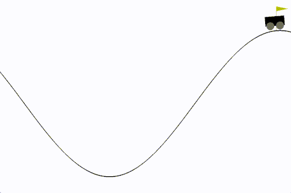
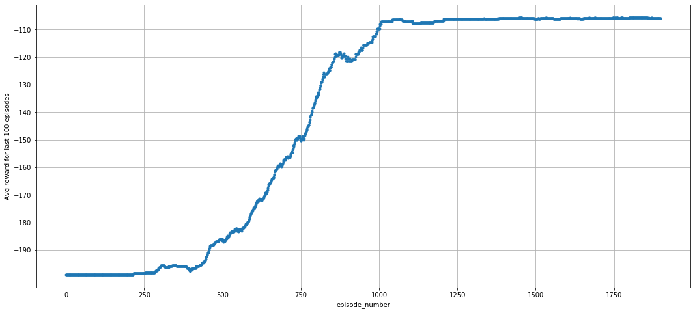
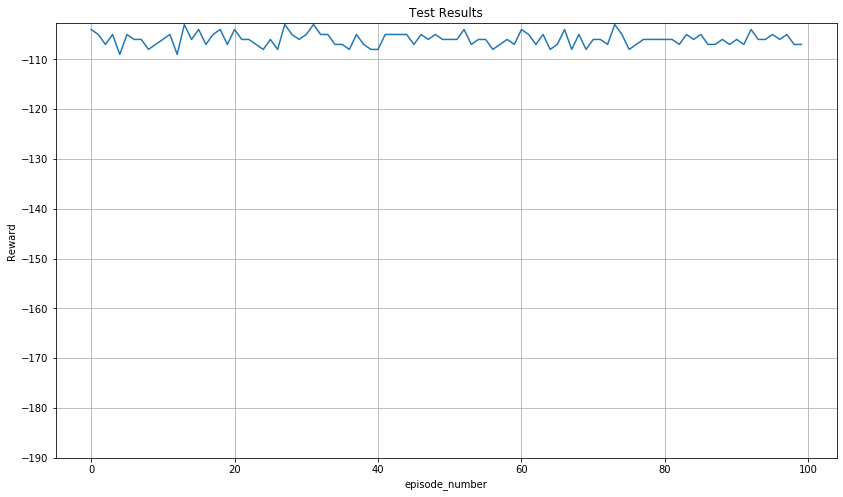

# OpenAI MountainCar-v0

### Training an Agent to solve the openAI gym's mountain car problem.
1. [Environment Details](https://github.com/openai/gym/wiki/MountainCar-v0)
2. [Leaderboard Page](https://github.com/openai/gym/wiki/Leaderboard#mountaincar-v0)

#### Mountain Car Problem: Get an under powered car to the top of a hill (top = 0.5 position)
1. Action Space: motor = (left, neutral, right):int
2. Observation Space: np.array([position, velocity])
    - Veclocity = (-0.07, 0.07)
    - Position = (-1.2, 0.6)

### Training: SARSA(&lambda;) Agent
#### Method:
1. Sarsa(&lambda;) with &lambda; = 0.8.
2. States are represeted by discretiziing the position and velocity.
3. epsilon-greedy policy with starting epsilon = 0.8 and decay rate = 0.995.
4. starting learning-rate(alpha) = 0.8 and decay rate = 0.999.
5. No reward shaping.
#### Goal:
Solving the problem means average reward of -110 or more for 100 consecutive iterations.

### Average reward during training

### Test for 100 episodes
Average Reward = -105.99

